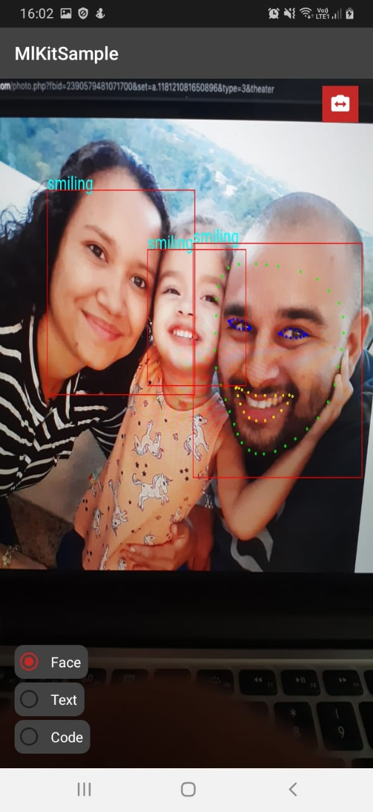
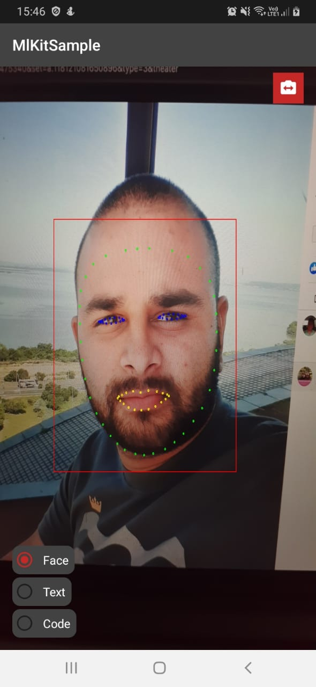
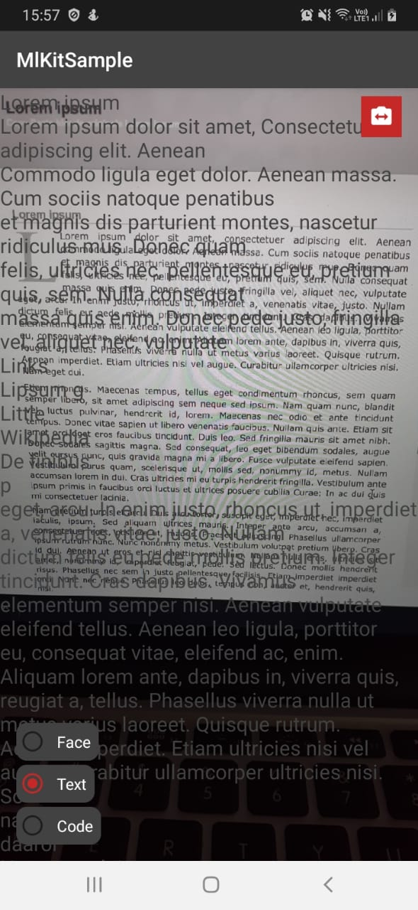
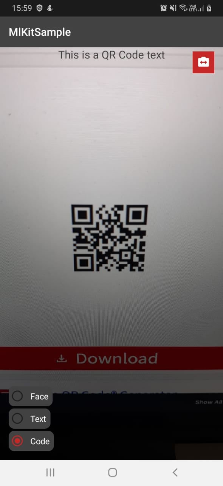

<h1 align="center">
    ML Kit Sample
</h1>

    Simple app to detect facial contours, text and read qrcodes using the firebase ML kit

## Screenshots

  
  

  
  

## Libs

- [MLkit](http://firebase.google.com/docs/ml-kit/)
- [CameraView](https://natario1.github.io/CameraView/home)

